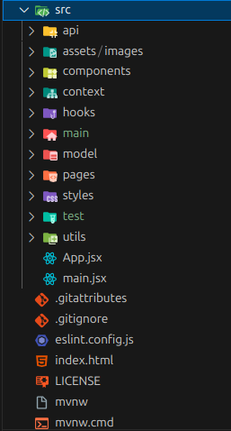

# 🍴 PickMe By Lolas

**PickMe By Lolas** es una aplicación web full-stack para solicitar comida, artículos de higiene y ayuda en merenderos o zonas rurales. Los pedidos se entregan de forma **segura mediante drones** en puntos designados.

Este proyecto forma parte del porfolio profesional de **RieraDiPe**.

---

## 🚀 Tecnologías utilizadas

- **Frontend**: React 18 + Vite
- **Backend**: Spring Boot 3.5, Java 17, PostgreSQL
- **Estilos**: CSS Modules + variables globales
- **Autenticación**: Context API + roles (`USER`, `CAMARERO`, `ADMIN`)
- **Persistencia en cliente**: `localStorage` (pedidos, usuarios, políticas, etc.)

---

## 🔑 Roles y vistas

- **Usuario (USER)**

  - Acceso a catálogo, carrito, políticas, validación QR.

- **Camarero (STAFF / CAMARERO)**

  - Gestión de pedidos en curso (cambiar estados).
  - Gestión de inventario (stock de productos).

- **Administrador (ADMIN)**
  - Todas las vistas anteriores.
  - Gestión de usuarios y roles.

---

## 📌 Funcionalidades principales

✔️ **Home con carrusel de imágenes**  
✔️ **Mapa interactivo** para seleccionar zona de entrega o SOS  
✔️ **Catálogo de productos** con control de cantidades  
✔️ **Carrito persistente** con totales en tiempo real  
✔️ **Validación QR** y flujo de seguridad  
✔️ **Políticas de uso** con aceptación y firma obligatoria  
✔️ **Pedidos** gestionados por camareros y admin  
✔️ **Inventario** editable en tiempo real  
✔️ **Panel de usuarios (admin)** para asignar roles

---

## 🧩 Arquitectura del frontend



---

## ⚙️ Validaciones

- **Checkout**:
  - Nombre y apellidos mínimo 2 caracteres
  - Email con expresión regular estándar
- **Políticas**:
  - Checkbox obligatorio
  - Firma de mínimo 5 caracteres
- **Login staff**:
  - Rol elegido (`USER`, `CAMARERO`, `ADMIN`)
  - Guardado en `localStorage`

---

## 🛠️ Cómo arrancar el frontend

```bash
# 1. Clonar el repositorio
git clone https://github.com/rieradipe/pickmebylolas.git

# 2. Entrar en el directorio
cd pickmebylolas

# 3. Instalar dependencias
npm install

# 4. Arrancar en modo desarrollo
npm run dev

# 5. La aplicación se abrirá en: http://localhost:5173


---
## 👩‍💻 Autor
Desarrollado por RieraDiPe

```
