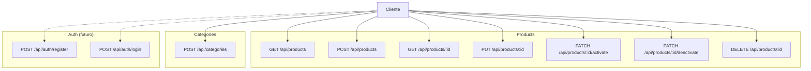

# Endpoints (MVP + futuro inmediato)

```mermaid
flowchart TB
  A[Cliente]

  subgraph Products
    P1[GET /api/products]
    P2[POST /api/products]
    P3[GET /api/products/:id]
    P4[PUT /api/products/:id]
    P5[PATCH /api/products/:id/activate]
    P6[PATCH /api/products/:id/deactivate]
    P7[DELETE /api/products/:id]
  end

  subgraph Categories
    C1[POST /api/categories]
  end

  subgraph Auth["Auth (futuro)"]
    U1[POST /api/auth/register]
    U2[POST /api/auth/login]
  end

  A --> P1
  A --> P2
  A --> P3
  A --> P4
  A --> P5
  A --> P6
  A --> P7
  A --> C1
  A -.-> U1
  A -.-> U2
```
