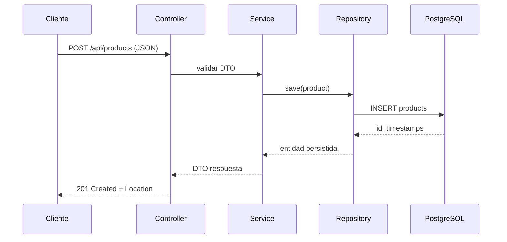

# Secuencia: crear producto

```mermaid
sequenceDiagram
  participant UI as Cliente
  participant C as Controller
  participant S as Service
  participant R as Repository
  participant DB as PostgreSQL

  UI->>C: POST /api/products (JSON)
  C->>S: validar DTO
  S->>R: save(product)
  R->>DB: INSERT products
  DB-->>R: id, timestamps
  R-->>S: entidad persistida
  S-->>C: DTO respuesta
  C-->>UI: 201 Created + Location
```
